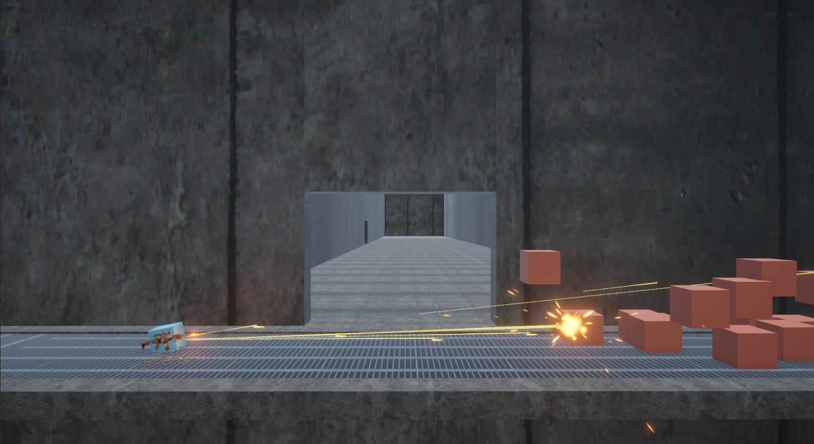

<!-- ABOUT THE PROJECT -->

## Mock Up
<table>
  <tr>
    <td></td>
  </tr>
  <tr>
    <th>Initial Version</th>
  </tr>
    <tr>
    <td></td>
  </tr>
  <tr>
    <th>Improved Version</th>
  </tr>
</table>

## Improvement Steps
- Step 1: Add **real** bullets 
- Step 2: Drop **bullet shell** when shooting
- Step 3: Add **Recoil effect** when shooting (the gun moves back a bit)
- Step 4: Add a **sound effect** when shooting
- Step 5: Add Muzzle Flash when shooting
  - Muzzle Flash is a visual effect that simulates the bright flash of light produced by the muzzle of a firearm when it is fired.
- Step 6: Trigger **Camera Shake** when shooting
- Step 7: Add **small explosion** when the bullet hits the target
- Step 8: Trigger **Damage Flash effect** when the enemy got hit
- Step 9: Add Bullet-trailing effect
- Step 10: Add Background music to create cinematic feel

## Top contributors:

(<a href="#readme-top">back to top</a>)

<!-- CONTACT -->
## Contact
[![LinkedIn][linkedin-shield]][linkedin-url]  
[![Facebook][facebook-shield]][facebook-url]  
[![Github][github-shield]][github-url]  
[![Itch][itch-shield]][itch-url]

(<a href="#readme-top">back to top</a>)

<!-- MARKDOWN LINKS & IMAGES -->
<!-- https://www.markdownguide.org/basic-syntax/#reference-style-links -->
[contributors-shield]: https://img.shields.io/github/contributors/NamPhuThuy/TN018-Game-Feel.svg?style=for-the-badge
[contributors-url]: https://github.com/NamPhuThuy/TN018-Game-Feel/graphs/contributors
[forks-shield]: https://img.shields.io/github/forks/NamPhuThuy/TN018-Game-Feel.svg?style=for-the-badge
[forks-url]: https://github.com/NamPhuThuy/TN018-Game-Feel/network/members
[stars-shield]: https://img.shields.io/github/stars/NamPhuThuy/TN018-Game-Feel.svg?style=for-the-badge
[stars-url]: https://github.com/NamPhuThuy/TN018-Game-Feel/stargazers
[issues-shield]: https://img.shields.io/github/issues/NamPhuThuy/TN018-Game-Feel.svg?style=for-the-badge
[issues-url]: https://github.com/NamPhuThuy/TN018-Game-Feel/issues
[license-shield]: https://img.shields.io/github/license/NamPhuThuy/TN018-Game-Feel.svg?style=for-the-badge
[license-url]: https://github.com/NamPhuThuy/TN018-Game-Feel/blob/main/LICENSE

<!-- Contact -->
[linkedin-shield]: https://img.shields.io/badge/-LinkedIn-black.svg?style=for-the-badge&logo=linkedin&colorB=555
[linkedin-url]: https://www.linkedin.com/in/trinh-nam/
[facebook-shield]: https://img.shields.io/badge/-Facebook-blue.svg?style=for-the-badge&logo=facebook&colorB=3842c6
[facebook-url]: https://www.facebook.com/namphuthuy957
[github-shield]: https://img.shields.io/badge/-Github-blue.svg?style=for-the-badge&logo=github&colorB=252525
[github-url]: https://github.com/NamPhuThuy
[itch-shield]: https://img.shields.io/badge/-itch.io-blue.svg?style=for-the-badge&logo=itch.io&colorB=f5f5f5
[itch-url]: https://namphuthuy.itch.io/

<!-- Mock Up -->
[product-screenshot]: images/avatar.png

<!-- Tech Stack -->
[Next.js]: https://img.shields.io/badge/next.js-000000?style=for-the-badge&logo=nextdotjs&logoColor=white
[Next-url]: https://nextjs.org/
[React.js]: https://img.shields.io/badge/React-20232A?style=for-the-badge&logo=react&logoColor=61DAFB
[React-url]: https://reactjs.org/
[JQuery.com]: https://img.shields.io/badge/jQuery-0769AD?style=for-the-badge&logo=jquery&logoColor=white
[JQuery-url]: https://jquery.com 
[Unity.com]: https://img.shields.io/badge/Unity-61DBFB?style=for-the-badge&logo=unity&logoColor=white&labelColor=black&color=black
[Unity-url]: https://unity.com/
[CSharp.com]: https://img.shields.io/badge/C%23-61DBFB?style=for-the-badge&logo=c%23&logoColor=white&labelColor=magenta&color=purple

[CSharp-url]: https://learn.microsoft.com/en-us/dotnet/csharp/

